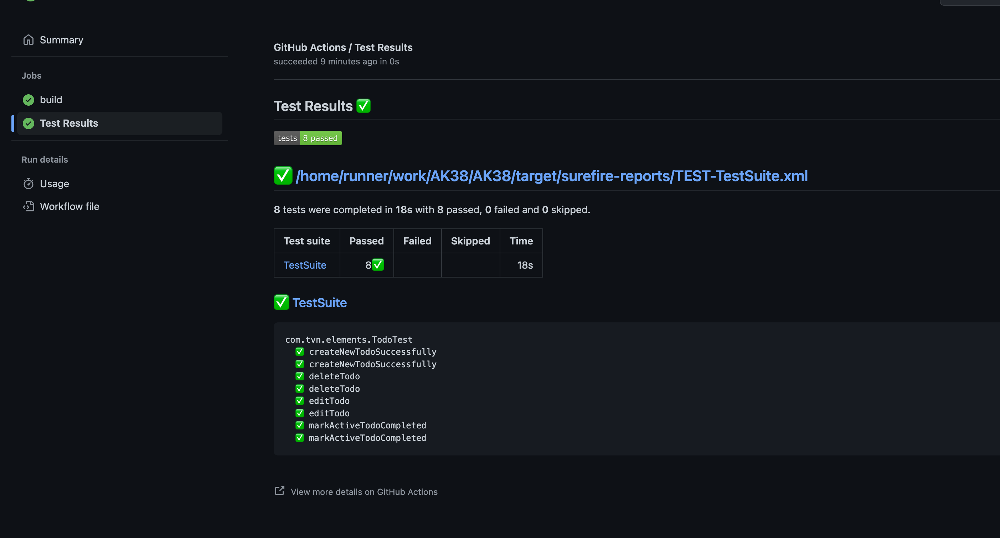

Selenium Java Basic AK38 with maven project

## Setup
1. Required JDK 11+
2. Install Maven
3. Install Chrome browser
4. Install Firefox Browser

## How to run
```shell
mvn clean test -Dtestsuite=todo-mvc.testplan.xml
```

## Framework Structure
```shell
.
├── JavaScriptAlert_TestPlan.xml
├── Readme.md
├── assets
│   └── githubActionReport.png
├── pom.xml
├── src
│   └── test
│       ├── java
│       │   └── com
│       │       └── tvn
│       │           ├── BaseTest.java
│       │           ├── BodyMassIndexTest.java
│       │           ├── browser
│       │           │   ├── OpenChromeBrowserTest.java
│       │           │   ├── OpenFirefoxBrowserTest.java
│       │           │   └── OpenSafariBrowserTest.java
│       │           ├── elements
│       │           │   ├── CheckboxTest.java
│       │           │   ├── ContextMenuTest.java
│       │           │   ├── DropDownTest.java
│       │           │   ├── GoogleSearchTest.java
│       │           │   ├── HoverTest.java
│       │           │   ├── HyperLinkTest.java
│       │           │   ├── JavaScriptAlertTest.java
│       │           │   ├── LoadingTest.java
│       │           │   ├── LoginTest.java
│       │           │   ├── NestedFrameTest.java
│       │           │   ├── Person.java
│       │           │   ├── Row.java
│       │           │   ├── TableTest.java
│       │           │   └── TodoTest.java
│       │           └── pages
│       │               ├── BasePage.java
│       │               ├── BodyMassIndexPage.java
│       │               ├── LoginPage.java
│       │               ├── SecurePage.java
│       │               └── TodoPage.java
│       └── resources
│           └── characters.json
└── todo-mvc.testplan.xml
```
*Suffix Rule*
- **Page.java --> define **page object class** and under [pages](/src/test/java/com/tvn/pages) package
- **Test.java --> define **test cases class**
- **.testplan.xml --> define **test plan to execute**

## Github Action Report


Everything as code
- Test as code ==> Automated Testing
- Infrastructure as code: K8s
- CI as code =>
- GitOps
- DataOps
- TestOps
Automation Process: 
- commit <> trigger test automatically
1 sprint - write 3 test cases(smoke test) - keep 3 months
- test case category
  - small  < 5 steps : 1 test case per day
  - medium 5< steps < 10: 2 test cases per 3 days
  - large  >10 steps: 1 test per week
18 test case UI automation ==> evidence show up KPI

1 KPI per year
1. Analyze requirements
2. Define test case/test plan
3. Execute test plan
4. Reporting